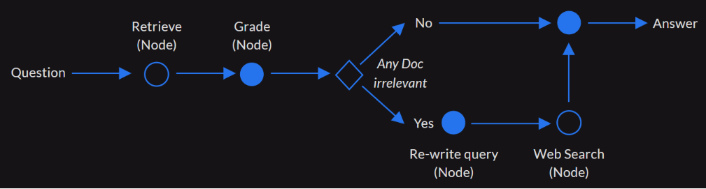
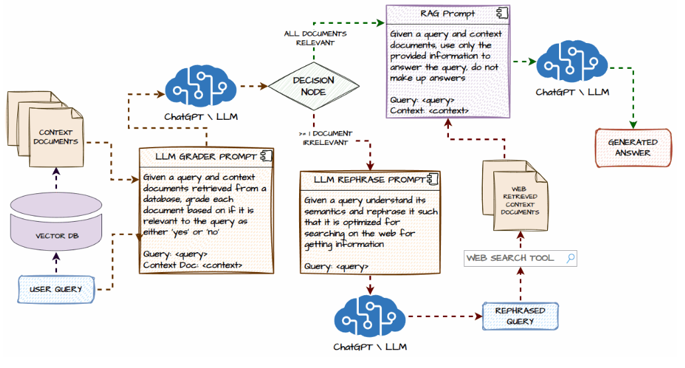

# ANA: Agentic Corrective RAG (CRAG) System with LangGraph

## Overview
This project is a hands-on demonstration of how to build an **Agentic Corrective Retrieval Augmented Generation (CRAG)** System using **LangGraph**. The idea is inspired by the *Corrective Retrieval Augmented Generation* research paper.

## Problem Statement
Traditional Retrieval Augmented Generation (RAG) systems face critical challenges:  
1. **Poor Retrieval Quality**: This can result in issues in LLM-generated responses.  
2. **Contextual Gaps**: Insufficient or irrelevant information in the vector database often leads to hallucinated or out-of-context answers.

## Proposed Solution
This project introduces a CRAG system that incorporates corrective measures to address these challenges:  
- Enhances retrieval mechanisms by implementing dynamic checks.
- Integrates web searches when the context documents retrieved are insufficient or irrelevant to the user query.  
- Employs a modular and agentic architecture to handle corrective retrieval seamlessly.



## Features
- **Ask ANA**: A user-friendly interface for querying a health assistant powered by Agentic RAG.
- **Interactive Analytics**: A comprehensive dashboard showcasing user engagement and popular query categories.
- **Corrective Agentic System**: Utilizes a modular design to handle tasks such as query processing, data retrieval and web search in self corrective manner.


## Installation
1. Clone the repository:
   ```bash
   git clone https://github.com/UsmanSafni/ANA.git
   ```
2. Navigate to the project directory:
   ```bash
   cd ANA
   ```
3. Install the required dependencies:
   ```bash
   pip install -r requirements.txt
   ```

## Usage
1. Run the application:
   ```bash
   streamlit run app.py
   ```
2. Access the app via the URL provided (default: `http://localhost:8501`).
3. Interact with ANA by typing a question and reviewing the response in the "Ask ANA" tab.
4. Explore query and user engagement analytics in the "View Analytics" tab.

## Demo
Available at:

[Demo](https://huggingface.co/spaces/Safni/ANA)

